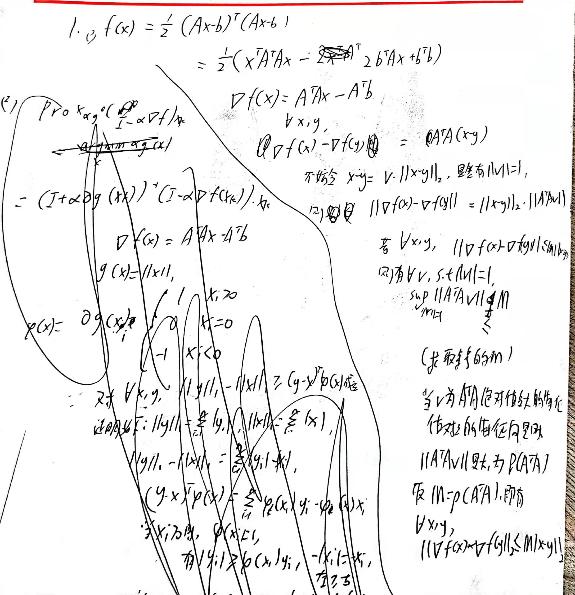
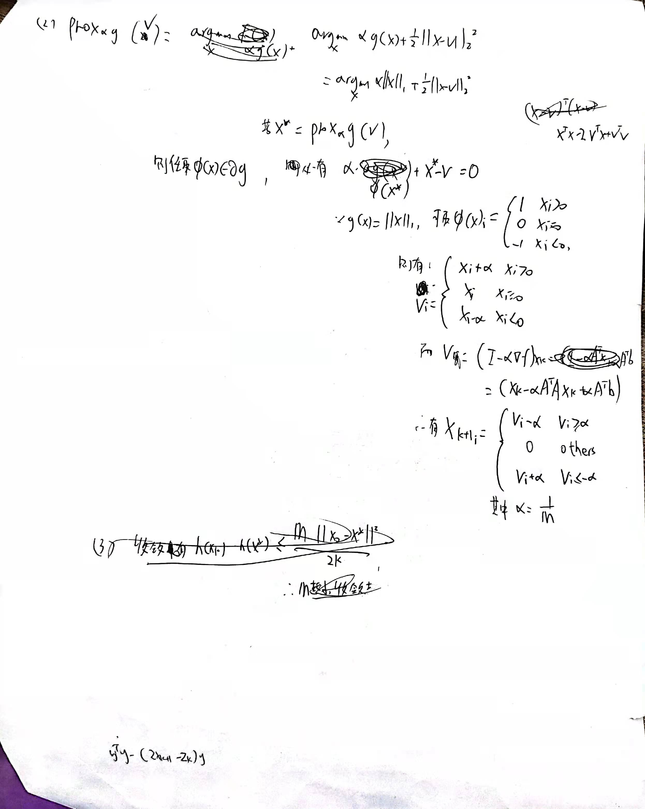
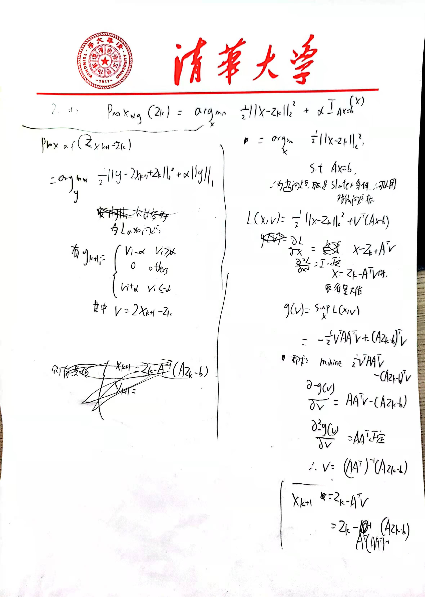
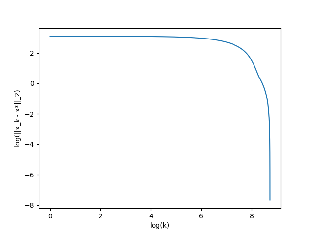
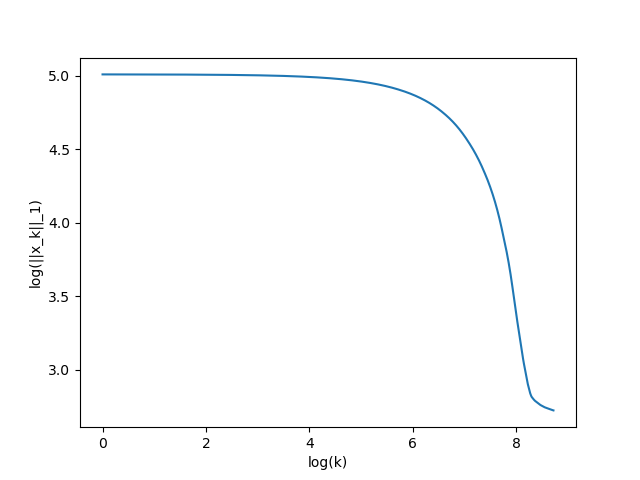
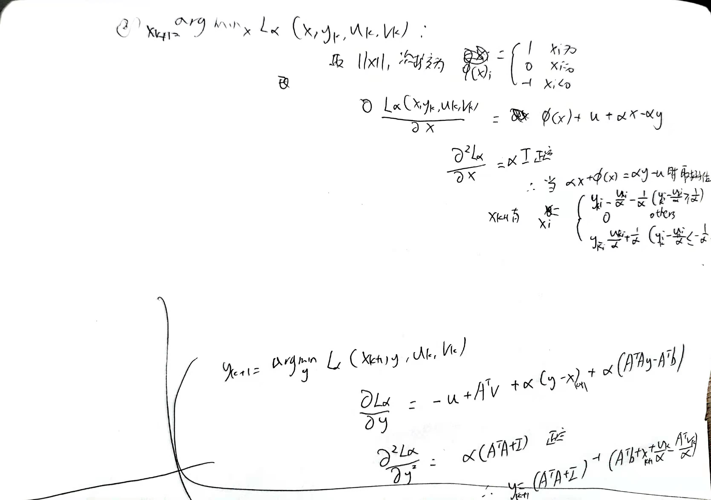
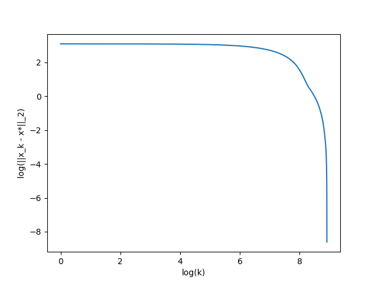
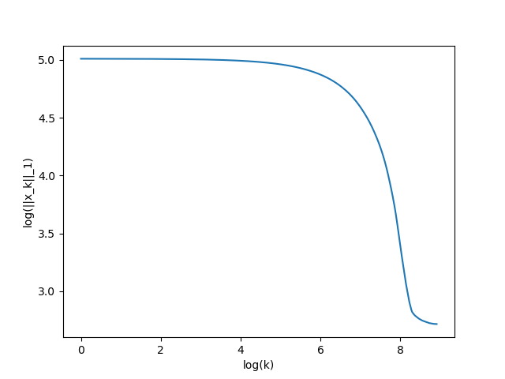
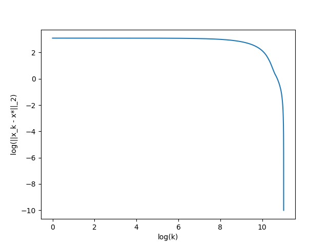
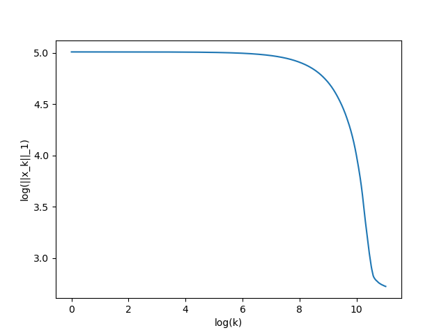

1.

(1)

(2)

(3)使用A1,b1求解，迭代547次后，得到最优值为10.640556454308745，x结果储存在根目录下result/Q1/x1.csv中

log(k)与log(||x_k-x*||_2)的图像如下

log(k)与log(h(x_k))的图像如下

log(k)与log(h(x_k-1) - h(x_k))的图像如下

使用A2,b2求解，迭代68188次后，得到最优值为11.938330644320333，x结果储存在根目录下result/Q1/x2.csv中

log(k)与log(||x_k-x*||_2)的图像如下

log(k)与log(h(x_k))的图像如下

log(k)与log(h(x_k-1) - h(x_k))的图像如下

(4)
$$
可以看出，A1收敛明显比A2要快很多，快了100多倍
该方法收敛性满足如下条件：\\
h(x_k) - h(x^*)\leq \frac{M||x_0-x^*||^2_{2}}{2k}\\
求得A_1的M_1为3040.0792115057775,A_2的M_2为1638363.7463906936\\
A_1迭代k_1=547次收敛，A_2迭代k_2=68188次收敛\\
\frac{M_2}{M_1}=538.9214005312704,\frac{k_2}{k_1}=124.6581352833638，两者在同一数量级，与理论相符合。
$$
2.

(1)推导如下

取alpha=1e-3,迭代得到最优值为15.245250663531616，最优解存储在根目录下result/Q2/x1.csv中

log(k)与log(||x_k-x*||_2)的图像如下：

log(k)与log(||x_k||_)的图像如下：

(2)推导如下

取alpha=1000,迭代得到最优值为15.1189574103693，最优解存储在根目录下result/Q2/x2.csv中

log(k)与log(||x_k-x*||_2)的图像如下：

log(k)与log(||x_k||_)的图像如下：

(3)推导如下

取alpha=10000/(M + 1),迭代得到最优值为15.245069566491548，最优解存储在根目录下result/Q2/x3.csv中

log(k)与log(||x_k-x*||_2)的图像如下：

log(k)与log(||x_k||_)的图像如下：

